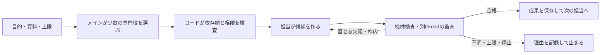

# multi-shadow-clone

Codexの既存サブスクリプションを使う、ローカルのマルチエージェントシステムです。製品名・GitHubリポジトリ名・将来のHomebrew名は `multi-shadow-clone` です。

**非公開の開発プレビューです。** リポジトリはprivateのまま保存し、public化は公開準備完了後に別途判断します。 この非公開チェックポイントは、新規展開で291件のオフライン検査を通した配布版を基準にしています。未完の開発差分・実行データ・調査原文は含めていません。macOSアプリの無料公開を目指していますが、署名済みアプリ・Homebrew導入・iPhoneリモート操作はまだ提供していません。アプリの追加料金は予定せず、推論には利用者自身のCodex契約と利用枠が必要です。

## 対応条件

- macOSとPython。実行確認はPython 3.14.7で行いました。3.11向けの構文検査は済んでいますが、3.11〜3.13での実行は未検証です。追加のPythonパッケージは不要です。
- 実Codexは、検証したアプリ同梱CLI `0.154.0-alpha.6.2`、`gpt-5.6-luna / low / default`、既存ChatGPT Pro認証を前提にします。現在の検証環境のCLI配置は `/Applications/ChatGPT.app/Contents/Resources/codex` です。
- 同じ接続で通常枠の利用許可、追加creditsが0、対象枠の利用率100%未満、実効設定・指示ファイルを確認できない場合は送信しません。自動購入、reset、従量API、別モデルへの代替はありません。
- 別のCLI版・モデル・OSを自動で対応済みにしません。対象環境で接続契約の検証が必要です。サブスクリプション枠は他のCodexタスクと共有され、無制限ではありません。

## 使う

メイン・専門担当・独立監査の共通設定は `src/multi_shadow_clone/orchestration/infrastructure/codex_provider.py` の `CodexProfile` に集約しています。既定値はGPT‑5.6 Luna / low / default。BOT用の子プロセスにだけ明示し、アプリ全体の設定を書き換えません。運転席の「設定を読み込む」から共通または役別のモデル・推論強度を保存できます。対応はLunaとAstraの実カタログで確認できる組合せだけです。新しい仕事へ設定版を固定し、既存の仕事は元の設定を維持します。週間使用量はアカウント全体の観測で、BOT別の消費量ではありません。

`multi-shadow-clone` ディレクトリをCodexで開きます。操作を依頼するなら、次の文章を使えます。

```text
このREADMEを読み、まずofflineで起動と停止を確認して。
実Codexを使うときは既存契約枠の前提を確認し、
追加購入もモデル設定の変更もしないで運用画面を起動して。
```

```sh
python3 -I tools/verification/host.py
python3 -I tools/multi-shadow-clone/host.py roles
python3 -I tools/multi-shadow-clone/operator.py --mode offline
```

表示された `http://127.0.0.1:ポート/` を開きます。空きポートを選びます。画面から依頼と資料を保存し、仕事の「実行」で動かします。保存・停止解除だけではモデルを呼びません。offlineは固定応答による操作練習であり、AIの分析結果ではありません。

実Codexの画面は次の入口です。起動だけではモデルを呼びませんが、認証や設定の読取りは行います。

```sh
python3 -I tools/multi-shadow-clone/operator.py --mode codex
```

CLIで保存してから実行することもできます。

```sh
python3 -I tools/multi-shadow-clone/host.py --mode codex submit examples/request.json
python3 -I tools/multi-shadow-clone/host.py --mode codex run <返されたrun_id>
python3 -I tools/multi-shadow-clone/host.py --mode codex status <run_id>
python3 -I tools/multi-shadow-clone/host.py --mode codex stop <run_id>
```

## 仕事の仕組み



役は60種類の職務契約です。呼ぶ条件、提出物、作業手順、保留条件を持ちます。[役の一覧](docs/roles.md)を参照してください。同時に60体を動かさず、同じDB内の実行は最大2試行。標準は1仕事12回送信、15分、各担当3生成試行までで、計画・監査・修正も同じ上限へ数えます。

専門役は渡された資料から文章・分析・設計・コード差分案を返します。ホストが専用workspaceとjob policyを明示した担当だけ、許可ファイルの読取り・hash照合付き変更・登録検査を使えます。任意shellや自由な外部送信先は提供しません。[専用作業場所の運用](docs/owned-workspace-jobs.md)に準備・実行・復旧・退役の手順があります。肩書きや性格は、資格や誤りのない答えの保証ではありません。

Domainは規則、Applicationは仕事の順序と停止、InfrastructureはCodex・SQLite・OS、PresentationはCLIと画面を担当します。`orchestration`は仕事、`knowledge`は根拠、`delivery`は投稿、`evaluation`は比較問題、`execution`は予約したファイル操作・登録検査・所有資源の退役を所有します。具象の組立ては `src/multi_shadow_clone/bootstrap.py` にまとめています。

## 停止と再起動

画面の「停止」は保存してから進行中のCodexへinterruptを要求します。相手の処理が瞬間的に消えたという意味ではありません。画面の端末でCtrl+Cすると、その画面が実行している仕事を停止し、所有するworkerと接続を終了します。

再起動後は `list` → `status` → 不明なら `reconcile <run_id>` の順に読みます。`resume <run_id>` は停止解除で、送信上限や期限を増やしません。認証・枠の停止は原因の解消後に停止解除してから実行します。上限や期限に達した依頼は、必要なら新しい予算の依頼として作成します。

不明な送信は予約を保持し、盲目的に再送しません。入力・役・コード・Codex実行ファイル・共通指示が変わった仕事の古い承認は再利用しません。画面の緑は有効な生存通知、灰色は待機する候補、通信不明は別の状態です。

Macのスリープやネット切断はローカル処理を止めます。常時稼働を保証するクラウドサービスではありません。

## 根拠の記憶

`tools/multi-shadow-clone/knowledge.py` の `register` は、本文・題名・URL・確認日・読解範囲・権利を持つ自作snapshot JSONを登録します。URLだけで本文を取得しません。`claim` で主張を登録し、`prepare-review` で保存したレビューjobを実行し、`support` で独立監査済みの肯定結果だけを支持済みへ昇格できます。否定のレビューが正常に完了しても、その主張を支持しません。

関係は `supports / contradicts / supersedes`。新しさだけで上書きしません。`retract` は失効、`erase` は自分が管理する出典・主張・関係と関連するjob本文を消去します。Codex側の履歴、配送先、手動export、backup、OS snapshotの全コピー削除とは異なり、全消去済みと表示しません。

## 専用GranSkypolisの任意接続

基本の分析には不要です。別途、対応するSuameriaソースが `~/workspaces/code/suameria-services` にあり、公式のworktree・Make・Docker手順が使える場合に限ります。この束にそのサービスのソースやDocker資源は含めません。

```sh
python3 -I tools/multi-shadow-clone/worktree.py start
python3 -I tools/multi-shadow-clone/host.py --mode codex create examples/private-post.json
python3 -I tools/multi-shadow-clone/host.py --mode codex run <run_id>
python3 -I tools/multi-shadow-clone/delivery.py send <run_id> announcement --business-key synthetic-demo-001
python3 -I tools/multi-shadow-clone/worktree.py status
python3 -I tools/multi-shadow-clone/worktree.py retire
```

正規の所有環境へ、監査済みの合成テキストを非公開投稿します。別URLや公開SNSへ切り替えません。同じ業務キー・正規化本文を重複させず、unknownは相手の確認済み能力に従って照合します。文字列の正規化は完全な意味判定ではありません。

複数件は `delivery.py send-batch --item <business_key> <run_id> <node_id>` の `--item` を繰り返します。最大20件で、残りの作用枠を含め一覧全体を検査・予約してから送信します。受領証が不明なら後続を止めます。受付の原子性は、配送先の全HTTP投稿が一度に成功・取消される意味ではありません。

配送の `stop` は未送信予約だけを `cancelled` にして枠を戻し、送信開始済みの `unknown` は保持します。`resume` や同じキーの再提出で取消済みの依頼は復活しません。新しい意図として再依頼する場合だけ別の業務キーを使います。重複を省略した別名キーもschema 2のSQLiteへ保存します。schema 1の既存操作は移行できますが、旧版が保存していない別名は復元できません。移行は停止中に行い、旧版でschema 2を開きません。

途中終了では `worktree.py recover` が同じoperationのreceiptと所有関係を読みます。seed成功が不明なら繰り返しません。退役では所有資源だけを正規手順で削除し、primary変更や所有不一致を力ずくで解消しません。global pruneは行いません。

## この束に入らないもの

ログイン情報、実行DB、provider履歴、配送記録、ブラウザ状態、調査動画、記事の全文、全字幕、Suameriaのソース、旧PoCを除いています。テストは合成データとfakeの接続を使います。Codexの実行ファイルや他社SDK・クラウドサービスは配布しません。

保存チェックポイントの由来は [保存した版の説明](docs/checkpoint.md) に記載しています。元の開発環境の検証結果を、新しい環境の実証と読み替えず、展開先で検査してください。利用条件は [NOTICE](NOTICE.md) を参照してください。

## 評価を版ごとに残す

`python3 -I tools/multi-shadow-clone/evaluate.py --study astra-low-v1 status`で指定版を読み、`status`を`run --case E01 --arm single`へ変えると既存Codex枠の確認後に比較を実行します。--studyはoperationより前です。旧sourceへ混入せず、旧DBと結果は保持します。初回receiptを上書きせず追加結果は別snapshotです。名前が新しくても問題は同じ公開pilot-v1であり、未知問題への評価とは呼びません。全評価版の失敗も比較に含めます。

## 役別の公開評価課題

`examples/evaluation/role-contracts-v1.json` は60役それぞれ1問の開発用課題です。専門能力の認定ではありません。モデル呼出しなしで現在のstudyを読む例：

```sh
python3 -I tools/multi-shadow-clone/evaluate.py --suite role-contracts-v1 --study role-contracts-astra-low-v1 status
```

配布束に元の実行DBは含まれないため、新規展開先の結果は0件です。`run --case R02-C01 --arm single` は明示的な実Codex呼出しです。通常枠などの前提確認を通った場合だけ実行します。対象役への直接single条件だけに対応し、60問の一括指定は上限超過として拒否します。既存の失敗を上書きせず、suiteとstudyとソース版を区別します。

提出表記を明記した課題版は `--suite role-contracts-v2` で選べます。数値・真偽・文字列・nullable文字列の提出欄を契約に保存し、対象役の生成要求へJSON Schemaを送ります。メイン計画と独立監査にも形式指定を送ります。構造化出力があっても従来の計画・内容・監査検査を省きません。計画と監査の形式は限定した合成課題で実Codex受入済みですが、一般的な専門品質の保証ではありません。旧版の失敗を消して合格数を増やさず、複合課題や実務の品質は別に確認してください。

## タスクの後片付け

終了した所有タスクは成果を保存して自動アーカイブする。失敗は `task_cleanup` の `cleanup_pending` に残る。生成を再実行せず、同じモード・データ保存先で次を実行する。

```sh
python3 tools/multi-shadow-clone/host.py --mode codex cleanup RUN_ID
```

他者タスクは対象外。終了不明は先に照合する。送信前のタスクは、作成接続で未永続化と明示確認しプロセス終了した場合に `released_unmaterialized`（未永続タスク解放）を記録する。`archived`（保存済み履歴のアーカイブ）とは異なる。判定できなければ保留する。
