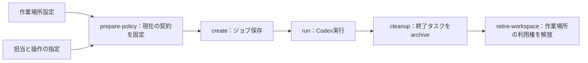
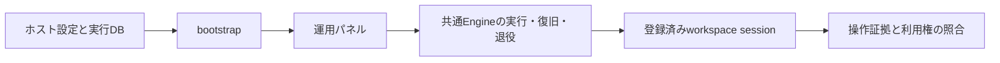

# 専用の作業場所を使うジョブ

この入口はホストが指定した場所だけにread/write/登録checkを付与する。Codexの既定はLuna / low / default。設定を読む、権限契約を準備する、ジョブを保存する操作ではモデルturnを送らない。実行は明示した `run` から始まる。



作業場所設定JSONの必須欄は `workspace_id`、絶対パスの `workspace_root`、相対パスの `paths`。登録検査を使う場合だけ `check_templates` と `container_profile` を指定する。検査プログラムのhashは固定し、変更可能なソースのパスを明示する。任意のコマンド文字列やダウンロード指示は受け付けない。

権限草案はversion=1、max_calls、scopesを持つ。各scopeはnode_id、stage（generate/audit）、role_id、workspace_id、operations、paths、checks、max_calls、max_bytesを指定する。検査が必須ならrequired_checksを加える。草案にはruntime_hashを書かない。prepare-policyが現在のホスト契約から埋める。すでにhashのある契約をこのコマンドで上書き更新することはできない。

以下はリポジトリルートで実行する手順。大文字のファイル名・JOB_IDは利用者の実際のファイル・IDへ置き換える。

```sh
python3 tools/kagebunshin/host.py --workspace-config WORKSPACE.json prepare-policy PLAN.json POLICY-DRAFT.json > POLICY.json
python3 tools/kagebunshin/host.py --mode codex --workspace-config WORKSPACE.json create PLAN.json --execution-policy POLICY.json
python3 tools/kagebunshin/host.py --mode codex --workspace-config WORKSPACE.json run JOB_ID
python3 tools/kagebunshin/host.py --mode codex --workspace-config WORKSPACE.json status JOB_ID
python3 tools/kagebunshin/host.py --mode codex --workspace-config WORKSPACE.json cleanup JOB_ID
python3 tools/kagebunshin/host.py --mode codex --workspace-config WORKSPACE.json retire-workspace JOB_ID
```

専用DBを選ぶ場合は同じ `--data-dir` を全操作へ指定する。offlineとcodexの既定DBは別。offlineは固定応答の説明用で、道具の実行能力を持たない。

結果不明なら先に `reconcile JOB_ID` を使う。再実行ではなく保存済みモデル応答と検査結果を照合する。解消しない間は利用権を解放しない。STOPは通常の一時停止、retire-workspaceは取り消せない終了で、退役開始後のresumeは拒否される。

`cleanup` は終了したCodexタスクのarchive、`retire-workspace` は操作・検査資源の退役とworkspace利用権の解放。元の作業場所や利用者のソースファイルそのものは削除しない。専用Suameria worktreeの削除は別の正規 `worktree.py retire` を使う。

現時点では内部APIを通した実Codex2turnと実Docker退役を限定実証済み。上記CLIの別プロセス一貫試験も289検査版・実Codex2turnの合成課題で成功し、archive・lease解放・一時資源退役を確認した。一般利用向け画面、異常時のCLI復旧、未知の開発課題の品質は別途確認が必要。


## 運用パネルから同じ仕事を扱う

CLIで作った仕事を扱うときは、同じデータディレクトリとホスト設定を明示する。

```sh
python3 -I tools/kagebunshin/operator.py --mode codex --data-dir /absolute/private/job-state --workspace-config /absolute/private/workspace.json
```

起動だけではモデルturnを開始しない。仕事一覧にはworkspace IDと退役状態を表示し、実行中の試行や結果不明がない仕事に退役ボタンを出す。退役開始後は再開できない。役別モデル設定でEngineを切り替えても同じホストの道具sessionを使い、既存jobのpolicyを再照合する。画面の自由文入力からworkspace権限を作ることはなく、道具付きjobの作成は上記CLIの明示policyを使う。



291検査版では、CLI引数の受渡し・終了時の寿命管理、実ファイルとSQLiteを使うjob再読込、設定なしでの道具付きjob実行拒否、退役の画面use caseを確認した。今回の画面変更の描画と、画面経由の実モデル実行はまだ未確認。


## 加算fixtureを再現する

`examples/workspace/addition-files.json` は不具合のあるソースと固定検査、`addition-plan.json` はR40実装/R46監査、`addition-policy-draft.json` は各段階1操作だけの権限草案である。既知の教材であり、専門品質の未見評価には使わない。

利用者が確認したDocker profileを `PROFILE.json` に保存してから、以下をリポジトリルートで実行する。profileは `kind=local-container-v1`、Docker実行ファイルの絶対pathとSHA256、明示socket、server_id、server_version、既にローカルに存在するimage_idを持つ。例の古いMac情報をコピーせず、対象ホストで確認する。この準備処理はDockerやCodexを起動せず、イメージを取得しない。

```sh
python3 - PROFILE.json <<'PYCODE'
from pathlib import Path
from hashlib import sha256
import json, sys
profile = json.loads(Path(sys.argv[1]).read_text())
root = Path('runtime/addition-demo').absolute()
root.mkdir(parents=True, exist_ok=False, mode=0o700)
workspace = root / 'workspace'
workspace.mkdir(mode=0o700)
files = json.loads(Path('examples/workspace/addition-files.json').read_text())
for name, content in files.items():
    if name not in {'calc.js', 'check.js'}:
        raise ValueError('unexpected fixture path')
    (workspace / name).write_text(content)
config = dict(workspace_id='addition-fixture', workspace_root=str(workspace),
    paths=['calc.js', 'check.js'], container_profile=profile,
    check_templates=[dict(check_id='arithmetic', entrypoint='check.js',
        fixed_inputs=[['check.js', sha256(files['check.js'].encode()).hexdigest()]],
        mutable_paths=['calc.js'], timeout=10, max_input_bytes=4096, max_output_bytes=1024)])
(root / 'workspace.json').write_text(json.dumps(config, indent=2))
print(root / 'workspace.json')
PYCODE
python3 -I tools/kagebunshin/host.py --data-dir runtime/addition-demo/jobs --workspace-config runtime/addition-demo/workspace.json prepare-policy examples/workspace/addition-plan.json examples/workspace/addition-policy-draft.json > runtime/addition-demo/policy.json
```

既存の `runtime/addition-demo` がある場合は上書きせず停止する。作成後は同じdata-dir/workspace-configで `create`・`run`・`cleanup`・`retire-workspace` を使う。`create`のplanは `examples/workspace/addition-plan.json`、execution-policyは `runtime/addition-demo/policy.json` を指定する。実行は最大2モデルturnで、成功を保証しない。不明状態のままディレクトリを削除しない。退役の成功を確認してから、所有するこの教材ディレクトリを片付ける。


## 2026-09-14：実操作済みworkspaceの画面退役

固定providerが実write→実Docker checkを完了し、lease取得済みのEngineを専用HTTPパネルへ接続。ブラウザの退役ボタンからretired表示・再開無効化・退役説明を確認。実DBのlease released、実Docker ID一覧でcontainer不在・snapshot不在を照合。所有サーバーexit0、タブ終了、fixture削除済み。operator-owned-retire-v1-summary.jsonが根拠。モデル0/固定2、4役のテスト名簿を使用した機構検証で、実Codex画面実行の実証ではない。

正常退役後に変更原因を断定する旧history-noteが出ていたため、workspace_retirementがある場合は専用badgeと退役説明を使うよう修正。JS構文/291検査成功、修正後の表示は未再描画。累計193実turnのまま。次は元調査/未見品質と、最新修正の描画・配布同期を進める。
